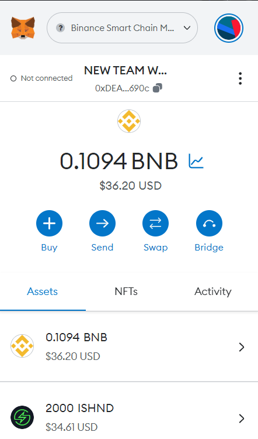
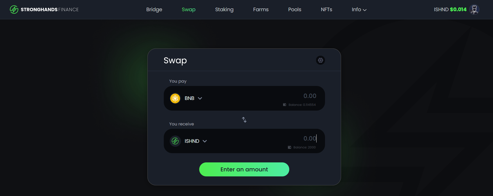

Setting Up Your Wallet
======================

When you go to `sushi.com <https://www.sushi.com/>`_, enter the app and click *Connect Wallet*; you will see a list of wallet options to choose from. For some beginners, this list can be daunting. To help out new users to our platform, we will show you how to set up a MetaMask wallet extension on your desktop!

1. Head over to `https://metamask.io <https://metamask.io>`_.

2. Download and install the Metamask version compatible with your browser.

3. After it's finished downloading, click *Get Started*.

   .. image:: ../../images/suyw1.png
      :alt: welcome
      :width: 70%

4. Click *Create a Wallet*.

   .. image:: ../../images/suyw2.png
      :alt: backup
      :width: 70%

5. Agree or disagree to information collection.

6. Create your password (you won't need a username!)

7. You will be given your backup phrase, also known as your "private key," which is made up of 12 words. It is good practice to write this down somewhere safe and never show or tell anyone these words. Anyone who has this phrase can access your assets and do as they please with them, so don't ever give it to anyone!

   .. image:: ../../images/suyw3.png
      :alt: backup
      :width: 70%

8. Congratulations, your wallet has successfully been created! Your account number or wallet address will look something like this: ``0x48F7D383399700ac1302aFF938cD46d138008676`` or as seen in the photo below: ``0x48F7...8676``. If you click on this number (abbreviated below "Account 1"), your computer will automatically copy the address.

   .. image:: ../../images/suyw4.png
      :alt: backup
      :width: 70%

9. If you already own cryptocurrencies, you can add assets by copying your wallet address and sending the assets you own to that address.

10. In order for your tokens to display in your wallet, you need to add the token first. Let's start by adding $SUSHI!

11. To add the $SUSHI token to your wallet, start by heading to: `https://etherscan.io/ <https://etherscan.io/>`_

12. Search *Sushi* in the search bar and click the top result.

13. Copy the contract address.

    .. image:: ../../images/suyw5.png
       :alt: backup
       :width: 70%

14. Open MetaMask again. If you cannot find the extension, click the puzzle piece in the top right corner of your browser. Hint: you can pin MetaMask to your extensions for easier access as well!

15. Click *Add Token*.

    .. image:: ../../images/suyw6.png
       :alt: backup
       :width: 70%

16. Click *Custom Token*.

17. Paste the $SUSHI token contract address in and click *Next*.

    .. image:: ../../images/suyw7.png
       :alt: backup
       :width: 70%

18. Click *Add Token* and you should now see the $SUSHI token in your wallet!

Connecting Your Wallet to Sushi
Step 1.

Go to `stronghands.com <https://www.stronghands.com/>`_

Step 2.

Click Connect to a wallet in the top right corner.

:alt: backup
:width: 70%

Step 3.

Select MetaMask then click *Connect* in the MetaMask pop-up.

Step 4.
You will now see your wallet address in the top right corner!

You will need to approve Stronghand's access for each individual token you use on the platform. For example, if you want to buy $ISHND tokens with $USDC, you will need to approve Stronghand's access to the USDC token by paying a small connection fee. As we mentioned in the beginning of this tutorial, this fee, along with other fees on BSC, will need to be paid in Binance Coin (BNB). So, in order to access the StronghandSwap platform, you will need BNB in your wallet to pay the fees. If you do not have any Binance Coin, you will need to purchase some from a centralized exchange that services your region.